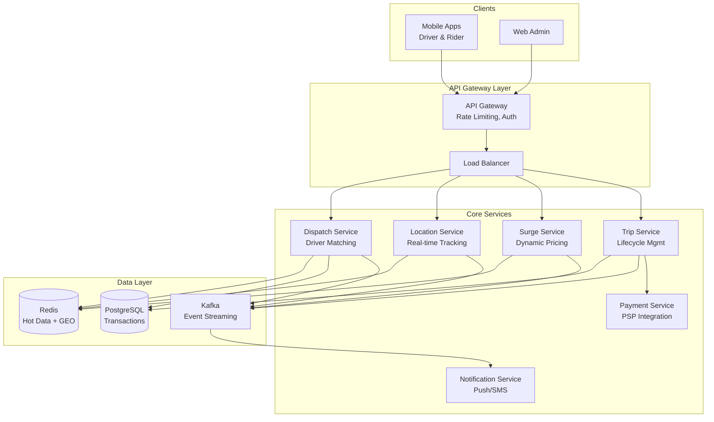
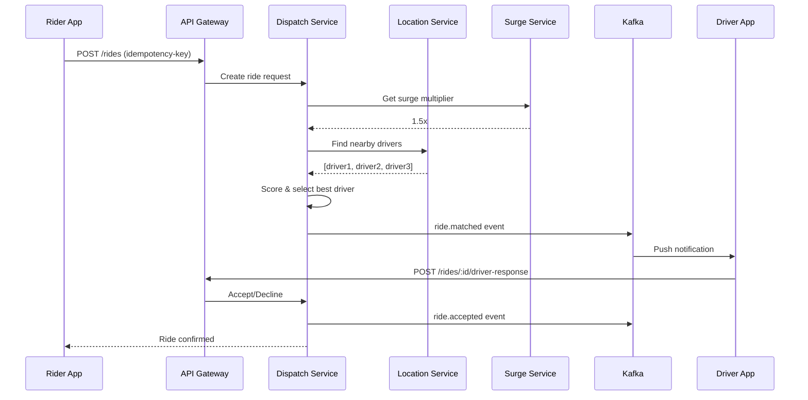
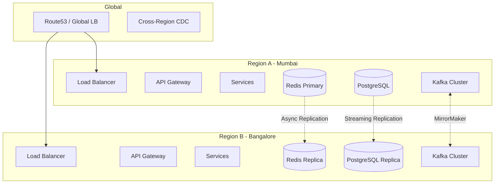

# High-Level Design (HLD) - Multi-Region Ride-Hailing Platform

## 1. System Overview

A globally distributed ride-hailing platform designed to handle:

- **300k concurrent drivers** globally
- **60k ride requests/minute** at peak
- **500k location updates/second** globally

---

## 2. Component Architecture

### 2.1 Core Services

| Service                  | Responsibility                                         | Storage            | SLO         |
| ------------------------ | ------------------------------------------------------ | ------------------ | ----------- |
| **Location Service**     | Real-time driver location ingestion & proximity search | Redis GEO          | p99 < 50ms  |
| **Dispatch Service**     | Driver-rider matching, offer management                | Redis + PostgreSQL | p95 < 1s    |
| **Surge Service**        | Supply/demand pricing per geo-cell                     | Redis              | p99 < 100ms |
| **Trip Service**         | Trip lifecycle, fare calculation                       | PostgreSQL         | p95 < 500ms |
| **Payment Service**      | PSP orchestration, retries                             | PostgreSQL         | p95 < 3s    |
| **Notification Service** | Push/SMS delivery                                      | Kafka consumer     | Best effort |

### 2.2 Data Flow - Ride Request

---

## 3. Multi-Region Architecture

### Region-Local Writes Strategy

- **Hot path (location, dispatch)**: Region-local only, no cross-region sync
- **Cold path (payments, trips)**: Async replication to DR region
- **Failover**: DNS-based with health checks, RTO < 60s

---

## 4. Storage Design

### 4.1 PostgreSQL (Transactional Data)

- **Use case**: Ride requests, trips, payments, user data
- **Sharding**: By `region` for horizontal scaling
- **Replication**: Streaming replication to read replicas

### 4.2 Redis (Hot Data)

- **Use case**: Driver locations (GEO), session cache, idempotency keys, surge values
- **Cluster mode**: For horizontal scaling
- **Persistence**: AOF for durability

### 4.3 Kafka (Event Streaming)

- **Topics**: ride._, trip._, driver._, payment._, surge.\*
- **Partitioning**: By region + entity ID for ordering
- **Retention**: 7 days for replay capability

---

## 5. Scaling Strategy

| Component            | Scaling Approach                   | Target Capacity     |
| -------------------- | ---------------------------------- | ------------------- |
| **API Gateway**      | Horizontal (K8s HPA)               | 100k RPS per region |
| **Location Service** | Horizontal + Redis sharding        | 500k updates/sec    |
| **Dispatch Service** | Horizontal                         | 60k matches/min     |
| **Redis**            | Cluster mode (6+ nodes)            | 1M ops/sec          |
| **PostgreSQL**       | Read replicas + connection pooling | 50k TPS             |
| **Kafka**            | Partition scaling                  | 100k events/sec     |

---

## 6. Trade-offs & Decisions

| Decision                             | Trade-off                               | Justification                                  |
| ------------------------------------ | --------------------------------------- | ---------------------------------------------- |
| **Redis GEO vs PostGIS**             | Less query flexibility, but faster      | p95 < 1s matching requires in-memory           |
| **Eventual consistency for surge**   | May show stale price briefly            | 60s cache acceptable for price updates         |
| **No cross-region sync on hot path** | Potential inconsistency during failover | Latency SLO cannot tolerate cross-region calls |
| **Idempotency in Redis**             | Lost on Redis restart                   | 24h TTL + PostgreSQL fallback acceptable       |
| **Kafka for events**                 | Operational complexity                  | Required for decoupling and replay             |
