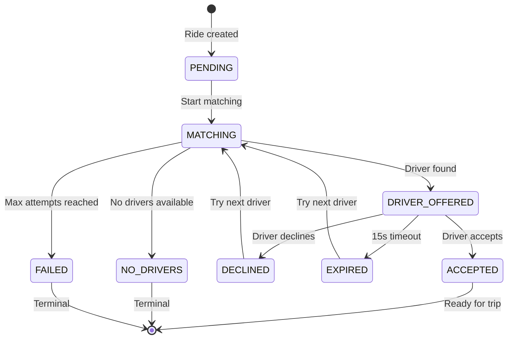
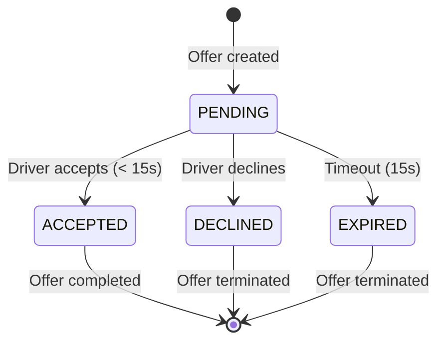
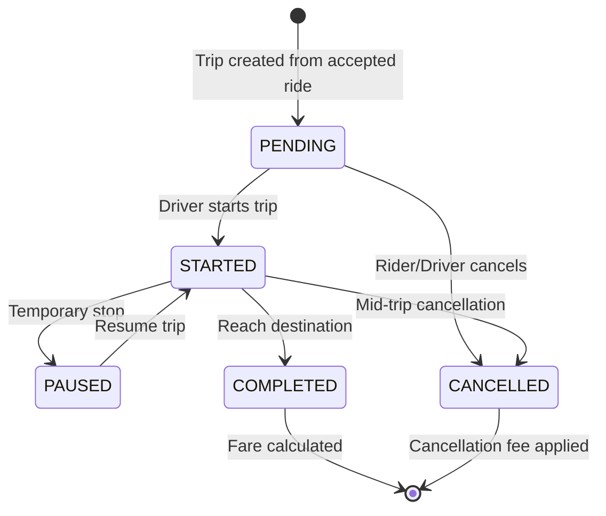
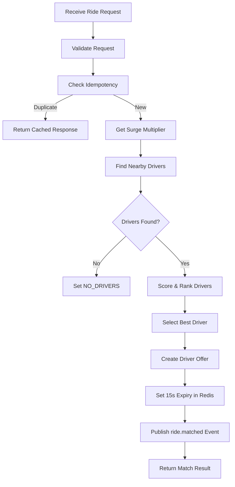
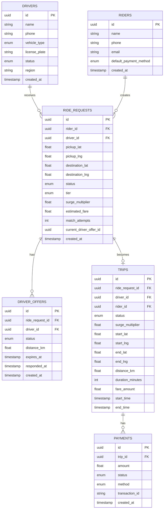
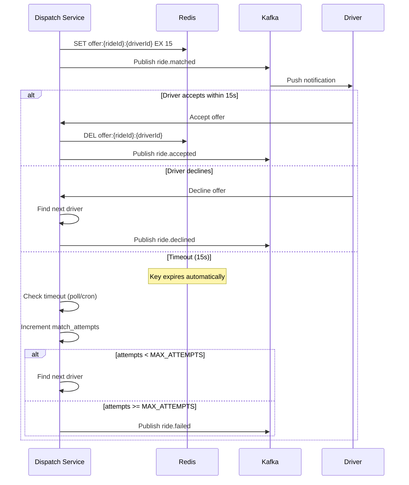

# Low-Level Design (LLD) - Dispatch/Matching Service

## 1. Overview

The Dispatch Service is the core matching engine responsible for:

- Receiving ride requests and finding optimal drivers
- Managing driver offers with timeouts
- Handling acceptance, decline, and reassignment flows
- Ensuring p95 matching latency < 1 second

---

## 2. State Diagrams

### 2.1 Ride Request State Machine



### 2.2 Driver Offer State Machine



### 2.3 Trip State Machine



---

## 3. Core Algorithms

### 3.1 Driver Scoring Algorithm

```javascript
function scoreDriver(driver, rideRequest) {
  const { distanceKm, vehicleType, rating, acceptanceRate } = driver;
  const { tier } = rideRequest;

  let score = 100;

  // Distance score (closer is better) - 40% weight
  score -= distanceKm * 8; // -8 points per km

  // Vehicle match bonus - 30% weight
  if (vehicleType === tier) {
    score += 30;
  } else if (canUpgrade(vehicleType, tier)) {
    score += 15; // Partial bonus for upgrade
  }

  // Rating bonus - 20% weight
  score += (rating - 4.0) * 20; // +/- based on 4.0 baseline

  // Acceptance rate bonus - 10% weight
  score += acceptanceRate * 10;

  return Math.max(0, score);
}
```

### 3.2 Matching Flow



---

## 4. Data Model

### 4.1 Entity Relationship Diagram



---

## 5. API Contracts

### 5.1 Create Ride Request

```http
POST /api/v1/rides
Idempotency-Key: {uuid}
Content-Type: application/json

{
  "riderId": "uuid",
  "pickup": { "lat": 12.9716, "lng": 77.5946 },
  "destination": { "lat": 12.98, "lng": 77.61 },
  "tier": "ECONOMY | PREMIUM | XL",
  "paymentMethod": "CARD | WALLET | CASH"
}

Response 201:
{
  "id": "uuid",
  "status": "MATCHING",
  "surgeMultiplier": 1.5,
  "estimatedFare": 253.26,
  "matchedDriver": {
    "driverId": "uuid",
    "distanceKm": 0.5,
    "eta": 3
  }
}
```

### 5.2 Driver Response

```http
POST /api/v1/rides/{rideId}/driver-response
Content-Type: application/json

{
  "driverId": "uuid",
  "action": "ACCEPT | DECLINE"
}

Response 200:
{
  "rideId": "uuid",
  "status": "ACCEPTED | DECLINED",
  "message": "Ride accepted successfully"
}
```

---

## 6. Event Schemas

### 6.1 Kafka Topics & Events

| Topic            | Event           | Payload                                          |
| ---------------- | --------------- | ------------------------------------------------ |
| `ride.requested` | Ride created    | `{ rideId, riderId, pickup, destination, tier }` |
| `ride.matched`   | Driver assigned | `{ rideId, driverId, eta, offerExpiresAt }`      |
| `ride.accepted`  | Driver accepted | `{ rideId, driverId, timestamp }`                |
| `ride.declined`  | Driver declined | `{ rideId, driverId, reason }`                   |
| `ride.expired`   | Offer timeout   | `{ rideId, driverId, offerId }`                  |
| `trip.started`   | Trip began      | `{ tripId, driverId, startLocation }`            |
| `trip.completed` | Trip ended      | `{ tripId, fare, distance, duration }`           |
| `surge.updated`  | Surge changed   | `{ geoCell, region, multiplier }`                |

---

## 7. Redis Data Structures

### 7.1 Keys & Patterns

| Key Pattern                  | Type   | Purpose             | TTL  |
| ---------------------------- | ------ | ------------------- | ---- |
| `drivers:locations:{region}` | GEO    | Driver positions    | None |
| `driver:{id}:presence`       | STRING | Online detection    | 30s  |
| `driver:{id}:meta`           | HASH   | Status, vehicleType | None |
| `surge:{region}:{geoCell}`   | STRING | Cached surge        | 60s  |
| `demand:{region}:{geoCell}`  | STRING | Request counter     | 5min |
| `offer:{rideId}:{driverId}`  | STRING | Offer expiry        | 15s  |
| `idempotency:{key}`          | STRING | Request dedup       | 24h  |

---

## 8. Timeout & Reassignment Flow



---

## 9. Concurrency Considerations

### 9.1 Race Conditions Handled

1. **Double acceptance**: Use Redis SETNX + PostgreSQL transaction
2. **Offer already expired**: Check Redis before accepting
3. **Driver already on trip**: Filter by meta.status = 'ONLINE'
4. **Concurrent ride requests**: Idempotency key prevents duplicates

### 9.2 Locking Strategy

```javascript
// Optimistic locking with version
async function acceptOffer(rideId, driverId) {
  const lockKey = `lock:ride:${rideId}`;
  const acquired = await redis.set(lockKey, '1', 'NX', 'EX', 5);

  if (!acquired) {
    throw new Error('Ride is being processed');
  }

  try {
    // Check offer still valid
    const offerKey = `offer:${rideId}:${driverId}`;
    if (!(await redis.exists(offerKey))) {
      throw new Error('Offer expired');
    }

    // Update in transaction
    await db.transaction(async (tx) => {
      await tx.query('UPDATE ride_requests SET status = $1 WHERE id = $2', [
        'ACCEPTED',
        rideId,
      ]);
      await tx.query('UPDATE driver_offers SET status = $1 WHERE id = $2', [
        'ACCEPTED',
        offerId,
      ]);
    });

    await redis.del(offerKey);
  } finally {
    await redis.del(lockKey);
  }
}
```
