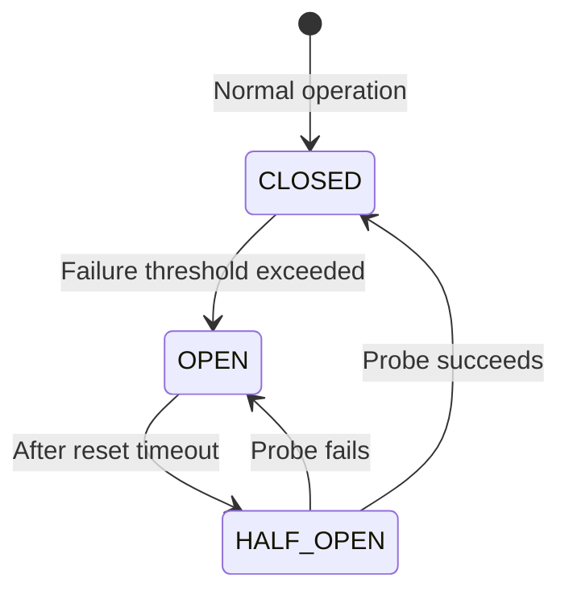
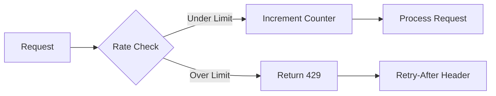
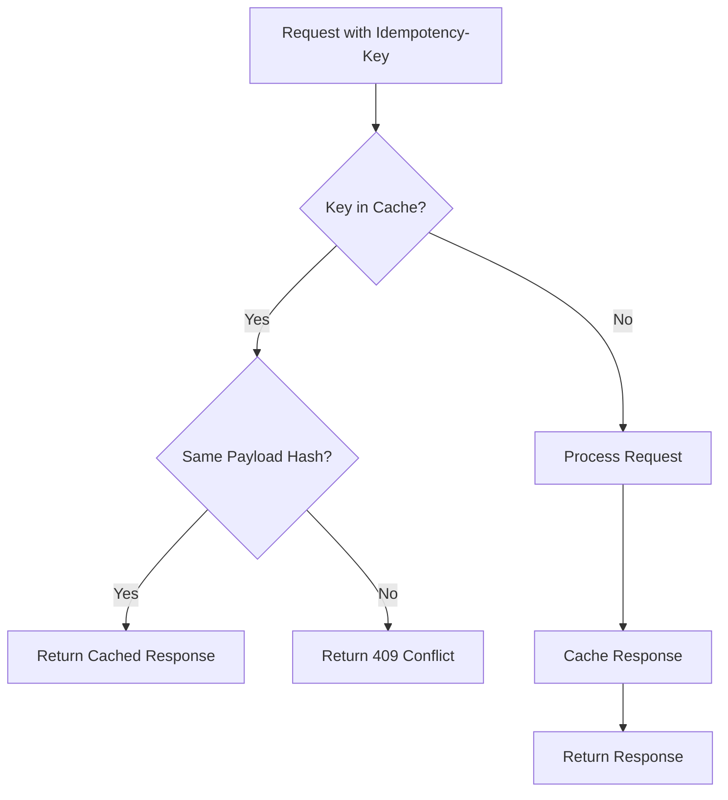
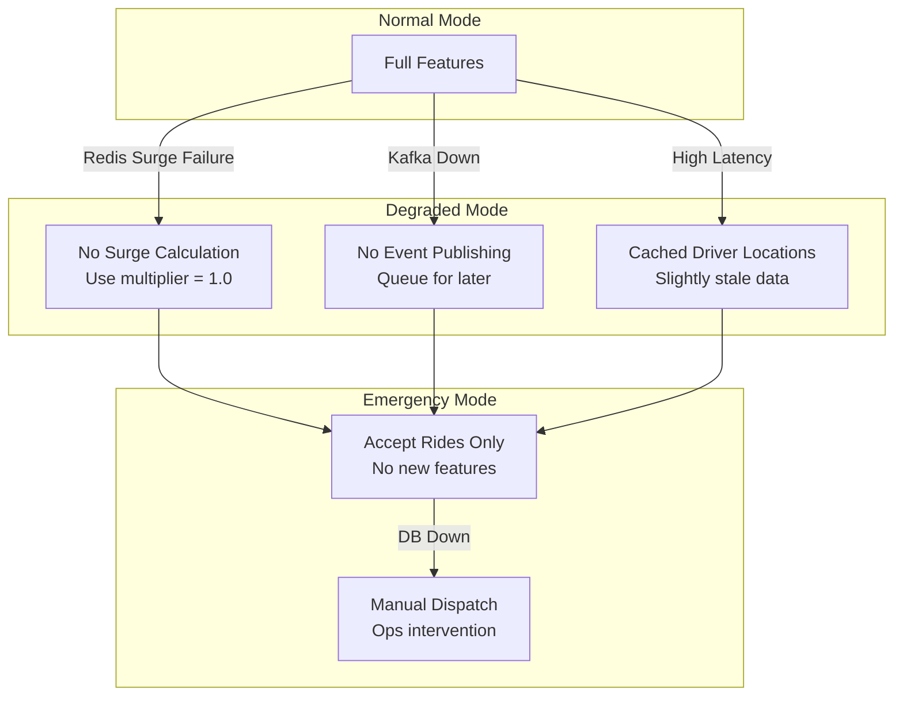

# Resilience Plan

## 1. Overview

This document outlines the resilience patterns, failure modes, and recovery strategies for the ride-hailing platform.

---

## 2. Resilience Patterns Implemented

### 2.1 Circuit Breaker



**Configuration:**
| Parameter | Value | Rationale |
|-----------|-------|-----------|
| Failure Threshold | 50% | Balance between tolerance and fast detection |
| Reset Timeout | 30s | Allow service recovery time |
| Request Timeout | 3s | Prevent cascading timeouts |
| Volume Threshold | 10 | Minimum requests before activating |

**Implementation:**

```javascript
const breaker = new CircuitBreaker(externalCall, {
  timeout: 3000,
  errorThresholdPercentage: 50,
  resetTimeout: 30000,
  volumeThreshold: 10,
});

breaker.fallback(() => cachedResponse); // Graceful degradation
```

---

### 2.2 Rate Limiting

**Algorithm:** Sliding Window Counter



**Configuration:**
| Tier | Limit | Window | Use Case |
|------|-------|--------|----------|
| Default | 1000 req | 60s | General API |
| Location Updates | 5000 req | 60s | High-frequency driver updates |
| Authenticated | 500 req | 60s | Per-user limit |

---

### 2.3 Idempotency

**Flow:**



**Storage:** Redis with 24h TTL
**Hash:** SHA-256 of request body

---

### 2.4 Retry Strategy

**Exponential Backoff with Jitter:**

```javascript
const retryConfig = {
  maxRetries: 3,
  baseDelay: 100, // ms
  maxDelay: 5000, // ms
  jitterFactor: 0.2,
};

function calculateDelay(attempt) {
  const exponential = Math.min(
    retryConfig.baseDelay * Math.pow(2, attempt),
    retryConfig.maxDelay,
  );
  const jitter = exponential * retryConfig.jitterFactor * Math.random();
  return exponential + jitter;
}
```

**Retry Matrix:**
| Error Type | Retry? | Max Attempts |
|------------|--------|--------------|
| 5xx Server Error | ✅ | 3 |
| 408 Timeout | ✅ | 3 |
| 429 Rate Limited | ✅ | 3 (with Retry-After) |
| 4xx Client Error | ❌ | 0 |
| Network Error | ✅ | 3 |

---

## 3. Failure Modes & Recovery

### 3.1 Failure Impact Matrix

| Failure                 | Impact                 | Detection             | Recovery             | RTO    |
| ----------------------- | ---------------------- | --------------------- | -------------------- | ------ |
| **Redis Down**          | No matching, no surge  | Health check          | Failover to replica  | < 30s  |
| **PostgreSQL Down**     | No new rides, no trips | Connection pool error | Promote replica      | < 60s  |
| **Kafka Down**          | No events (async)      | Producer error        | Queue locally, retry | < 5min |
| **Single Service Down** | Partial outage         | K8s probe             | Auto-restart         | < 10s  |
| **Region Down**         | Full outage            | DNS health check      | Route to DR          | < 60s  |

### 3.2 Degradation Strategies



---

## 4. Backpressure Handling

### 4.1 Load Shedding

```javascript
const LOAD_THRESHOLDS = {
  cpu: 80, // %
  memory: 85, // %
  queueSize: 1000, // requests
};

function shouldShed() {
  const metrics = getSystemMetrics();
  return (
    metrics.cpu > LOAD_THRESHOLDS.cpu ||
    metrics.memory > LOAD_THRESHOLDS.memory ||
    metrics.queueSize > LOAD_THRESHOLDS.queueSize
  );
}

// Middleware
app.use((req, res, next) => {
  if (shouldShed() && !isCriticalRequest(req)) {
    return res.status(503).json({
      error: 'Service temporarily overloaded',
      retryAfter: 5,
    });
  }
  next();
});
```

### 4.2 Priority Queuing

| Priority      | Request Type        | Treatment            |
| ------------- | ------------------- | -------------------- |
| P0 (Critical) | Active trip updates | Never shed           |
| P1 (High)     | Ride requests       | Shed at 90% capacity |
| P2 (Medium)   | Location updates    | Shed at 80% capacity |
| P3 (Low)      | Analytics, reports  | Shed at 70% capacity |

---

## 5. Health Checks

### 5.1 Liveness vs Readiness

| Check           | Type      | Failure Action    |
| --------------- | --------- | ----------------- |
| `/health/live`  | Liveness  | Restart container |
| `/health/ready` | Readiness | Remove from LB    |

### 5.2 Deep Health Check

```javascript
app.get('/health/ready', async (req, res) => {
  const checks = {
    postgres: await checkPostgres(),
    redis: await checkRedis(),
    kafka: await checkKafka(),
  };

  const allHealthy = Object.values(checks).every((c) => c.status === 'healthy');

  res.status(allHealthy ? 200 : 503).json({
    status: allHealthy ? 'healthy' : 'degraded',
    checks,
    timestamp: new Date().toISOString(),
  });
});
```

---

## 6. Monitoring & Alerting

### 6.1 Key Metrics (RED Method)

| Metric               | Alert Threshold | Severity |
| -------------------- | --------------- | -------- |
| Request Rate         | > 10k RPS       | Info     |
| Error Rate           | > 1%            | Warning  |
| Error Rate           | > 5%            | Critical |
| p95 Latency          | > 500ms         | Warning  |
| p95 Latency          | > 1s            | Critical |
| Circuit Breaker Open | Any             | Warning  |

### 6.2 Business Metrics

| Metric                   | Alert Threshold | Impact  |
| ------------------------ | --------------- | ------- |
| Match Success Rate       | < 95%           | Revenue |
| Driver Accept Rate       | < 70%           | UX      |
| Surge Calculation Errors | > 0.1%          | Revenue |
| Trip Completion Rate     | < 98%           | Trust   |

---

## 7. Disaster Recovery

### 7.1 Backup Strategy

| Data        | Frequency              | Retention | Location        |
| ----------- | ---------------------- | --------- | --------------- |
| PostgreSQL  | Hourly WAL, Daily full | 30 days   | S3 Cross-Region |
| Redis (AOF) | Continuous             | 7 days    | Local + Replica |
| Kafka       | Continuous             | 7 days    | Multi-broker    |

### 7.2 Recovery Procedures

**PostgreSQL Recovery:**

```bash
# Point-in-time recovery
pg_restore --target-time="2024-01-15 12:00:00" backup.sql

# Promote replica
pg_ctl promote -D /var/lib/postgresql/data
```

**Redis Recovery:**

```bash
# Failover to replica
redis-cli -h master CLUSTER FAILOVER
```

---

## 8. Chaos Engineering

### 8.1 Failure Injection Tests

| Test                    | Frequency | Expected Behavior            |
| ----------------------- | --------- | ---------------------------- |
| Kill random pod         | Weekly    | Auto-restart, no user impact |
| Redis latency injection | Monthly   | Fallback to cached surge     |
| Network partition       | Quarterly | Region isolation works       |
| Full region failover    | Quarterly | DR region handles load       |
